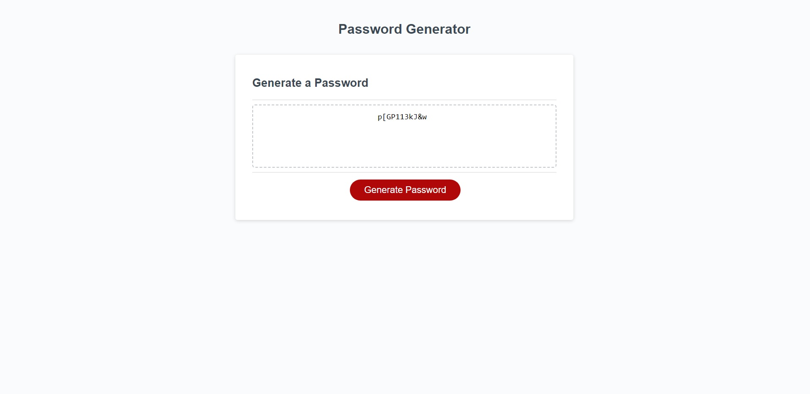

# Module 3 Challenge - Password Generator

## Description

This is a password generator built using JavaScript; while the HTML and CSS are from the starter code, the main JavaScript required to generate passwords was written by me. The password generator asks users for certain criteria they want their password to meet, such as types of characters to include and password length, then generates it and displays it on the screen for the user to copy.

## Usage/Preview

Users can generate their secure passwords by simply clicking the "Generate Password" button. The user will then face a series of prompts asking whether or not they would like the password to meet certain criteria; they will be able to decide if they want lowercase letters, uppercase letters, numbers, and special characters in their password. They will also be able to specify how long they want the password to be.

Users will not be able to generate a password without any criteria selected, and passwords must be between 8 and 128 characters long. The script does not allow for users to proceed with the password generation process until these conditions are met.

Live: https://irene-panis.github.io/password-generator/

## Credits

N/A

## License

N/A